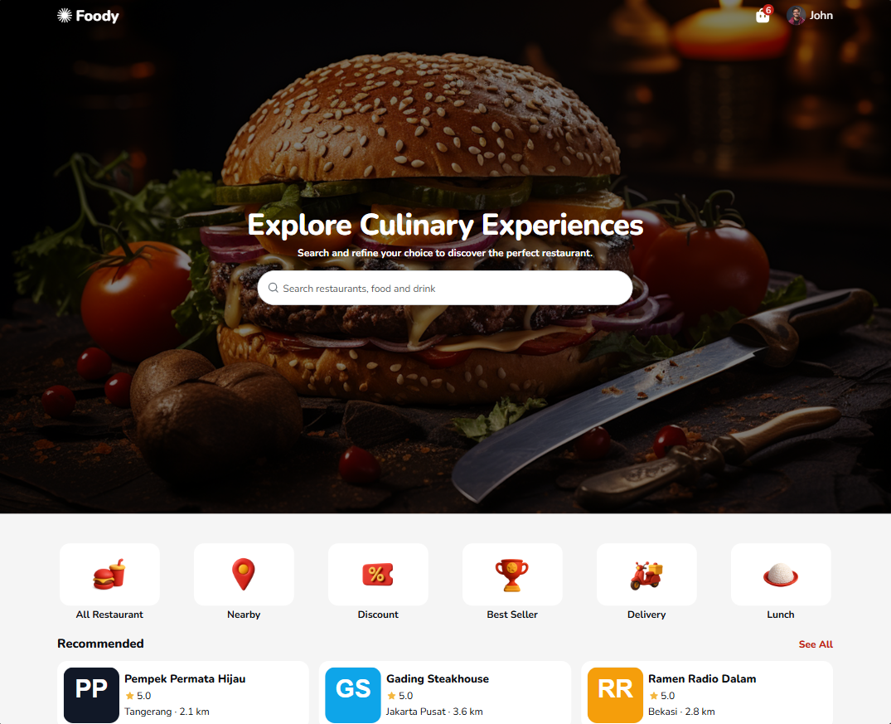
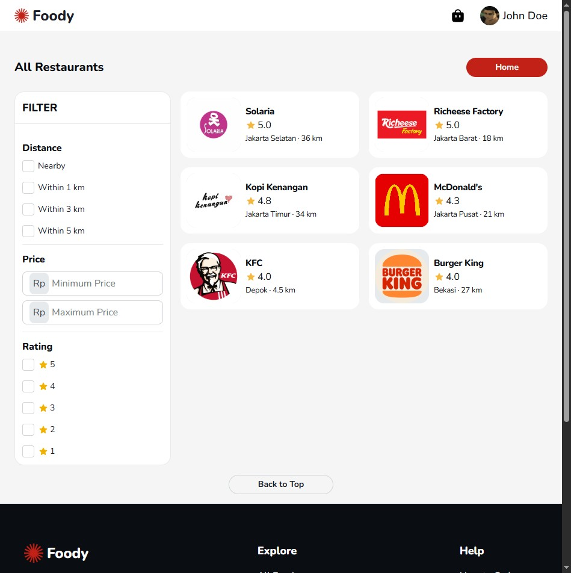
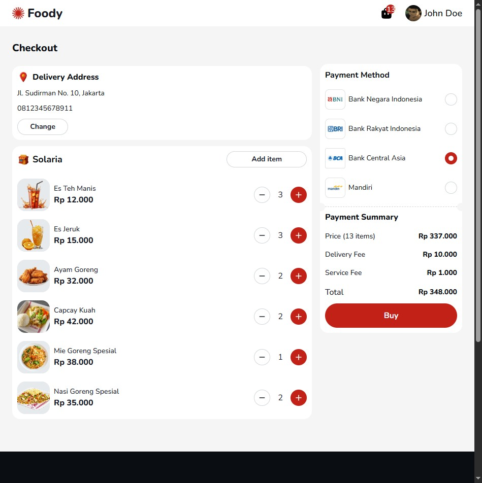
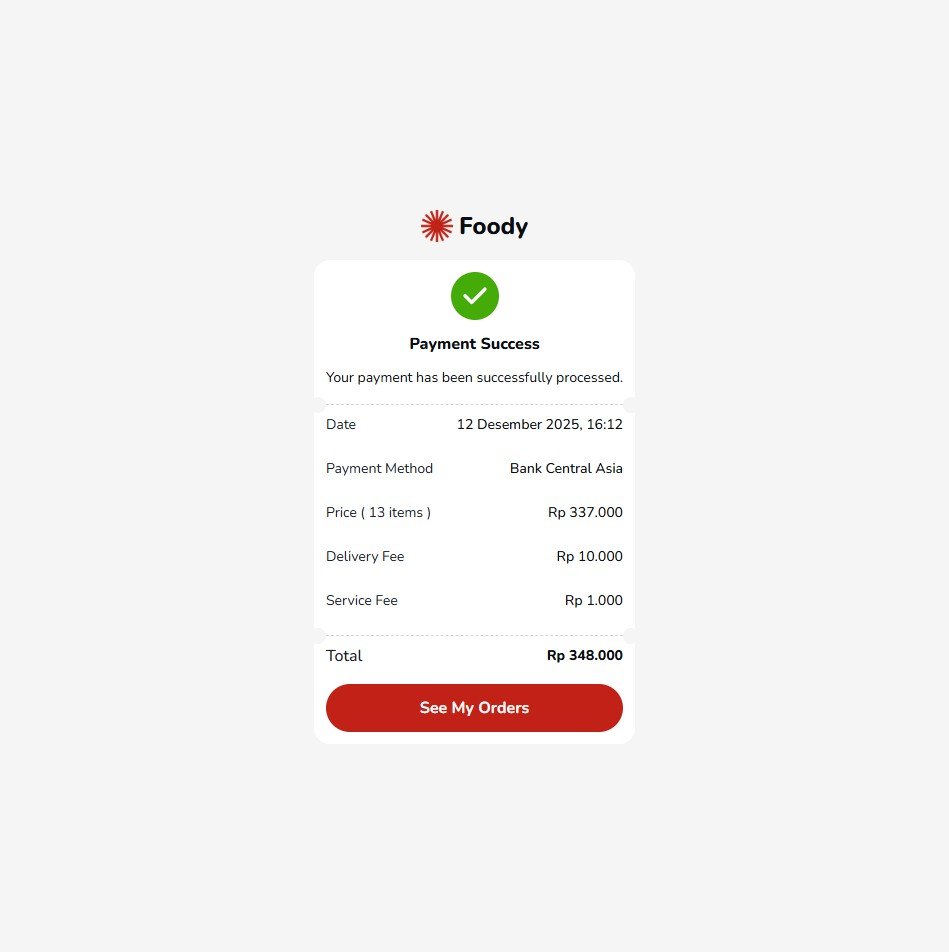
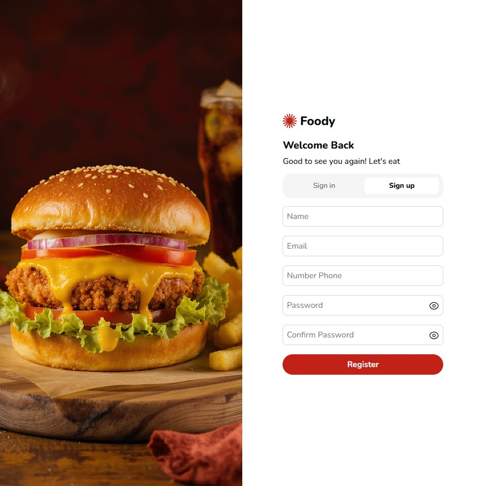
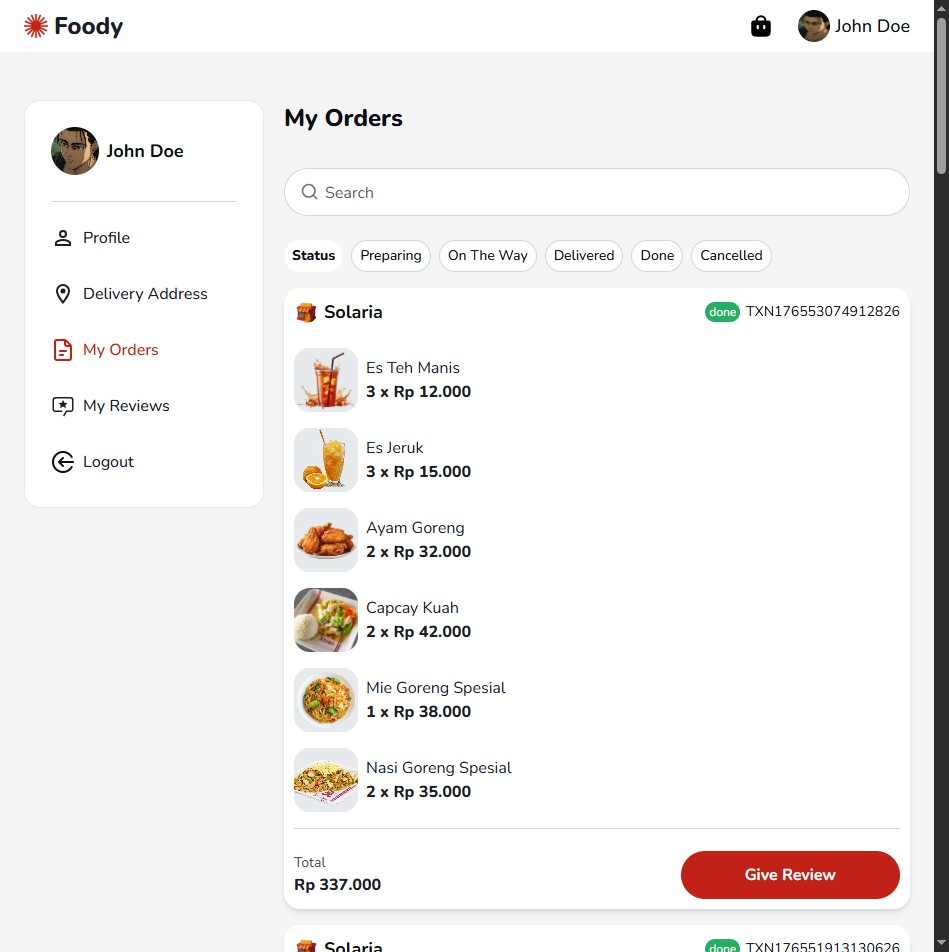
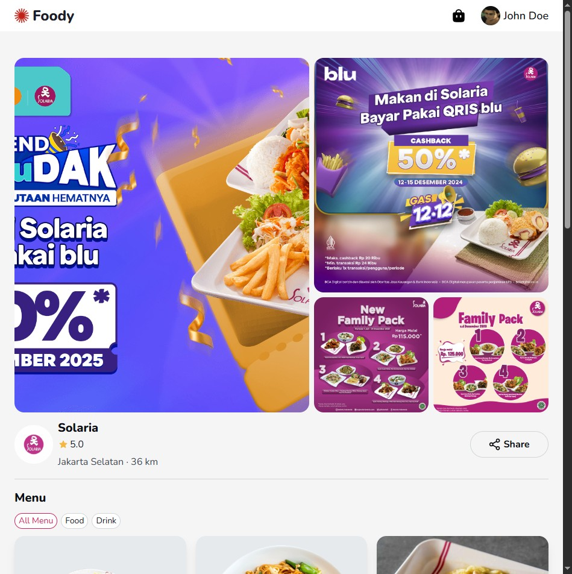

# 🍽️ Foody Restaurant App

Foody is a modern **restaurant web application** built with **React, Vite, and TypeScript**.  
It enables users to explore menus, apply filters, search dishes, manage their cart, and complete simple checkouts.  
Styled with **Tailwind CSS** and **shadcn/ui**, it leverages **Redux Toolkit** for UI state and **TanStack Query** for server data, ensuring fast, responsive, and structured user experiences.

---

## 🌐 Live Demo

👉 Try the application here: [Foody Restaurant App](https://foody-restaurant-app-wine.vercel.app/)

Use the following dummy account to log in and explore the features:

- **Email:** `user01@example.com`
- **Password:** `user1234`

---

## 🚀 Tech Stack

- **UI**: React 19, React Router DOM 7, Tailwind CSS 4 (with `@tailwindcss/vite`), Radix UI (Dialog, Select, Tabs, Tooltip)  
- **State & Data**: Redux Toolkit, React Redux, `@tanstack/react-query` v5, Axios  
- **Types & Validation**: TypeScript 5.9, Zod  
- **Icons & Styling**: `@iconify/react`, `lucide-react`, Class Variance Authority (CVA), `tailwind-merge`  
- **Utilities**: Day.js for dates, currency & formatting helpers  
- **Tooling**: Vite 7 (dev/build), ESLint 9 (+ react-hooks, react-refresh), `@vitejs/plugin-react`  
- **API / Backend**: Data powered by **Swagger REST API** (documented endpoints for authentication, restaurants, menus, orders, reviews, and cart)  

---

## ✨ Features

### 🔐 Authentication & Session
- Login/logout flow with token persistence  
- Guarded redirects on unauthorized routes  
- Session clear and cache reset on logout  

### 🧭 Global Navigation & Layout
- Sticky Navbar with cart badge & profile drawer (`SidebarProfile`)  
- Route-aware active state highlighting (text + icon switch to `text-primary-100`)  
- Consistent page containers with breakpoint-aware `max-w` and centered `md+` layouts  

### 👤 Profile Management
- View & update profile details (name, phone) with client-side validation  
- Dialog-based form with error messaging & success feedback  

### 📍 Delivery Address
- Address card showing phone & address with “Change” action  
- Responsive card layout (`md:max-w-[1000px]`)  

### 🛒 Cart & Checkout
- Cart summary & item counts from server cache  
- Checkout page + Success page (Navbar/Footer hidden per design)  

### 📦 My Orders
- Orders grouped by restaurant with transaction status & IDs  
- Search via `SearchBar`, loading skeletons, optimistic placeholders  
- Status filter via `SegmentedControl` (mobile scrollable, desktop horizontal wrapping)  
- “Give Review” action per order  

### ⭐ Reviews
- List user reviews with edit/delete actions (Dialog for edits)  
- Pagination & load-more behavior with error/empty states  

### 🏪 Restaurant Detail
- Restaurant information & menu sections aligned with design system components  

### 🎨 Design System Components
Reusable components:  
`Card`, `Button`, `IconButton`, `Dialog`, `Input`, `Badge`, `Skeleton`, `Alert`, `EmptyState`,  
`QuantityStepper`, `OrderSummary`, `AddressSummaryRow`, `MapPinChip`, `SegmentedControl`, `SidebarProfile`  
- CVA-based variants  
- Tailwind tokens with consistent spacing & typography  

### 📱 Responsiveness & UX
- Mobile styling preserved  
- `md+` layouts follow Figma with two-column grids & centered wrappers (`max-w 1000–1200px`)  
- Accessible focus states, rounded controls, clear affordances, sane defaults  

---

## 📄 Pages & Flows

- Home (via Navbar)  
- Restaurant Detail  
- Login / Signup  
- Profile  
- Delivery Address  
- My Orders  
- My Reviews  
- Cart  
- Checkout  
- Success  

---

## 🛠️ Development

- **Scripts**:  
  - `npm run dev` → Development server  
  - `npm run build` → Production build  
  - `npm run preview` → Preview build  
  - `npm run lint` → ESLint checks  

- **Build**: Vite production build with `tsc -b` type checking  
- **Linting**: ESLint 9 with React hooks & refresh plugins  

---

## 🌟 Showcase

Foody demonstrates how a **scalable, audit-ready frontend architecture** can deliver delightful restaurant experiences:  
- Clean separation of concerns (UI, State, Data, Utilities)  
- Strong type safety with TypeScript + Zod  
- Optimistic UI patterns for smooth UX  
- Reusable design system components for consistency  

---

## 📸 Preview

> All screenshots are stored in `public/` folder and rendered below.

### 🏠 Home Page  

### 🍔 All Restaurants  

### 🛒 Cart Page  

### 💳 Checkout Page  

### ✅ Success Page  

### 🔐 Login Page  

### 📦 Orders Page  

### 🏪 Restaurant Detail  

---

## 🔗 Connect

If you enjoyed this project, feel free to ⭐ the repo and share it!  
Perfect for showcasing **modern React + TypeScript workflows** with **professional UI/UX design**.
